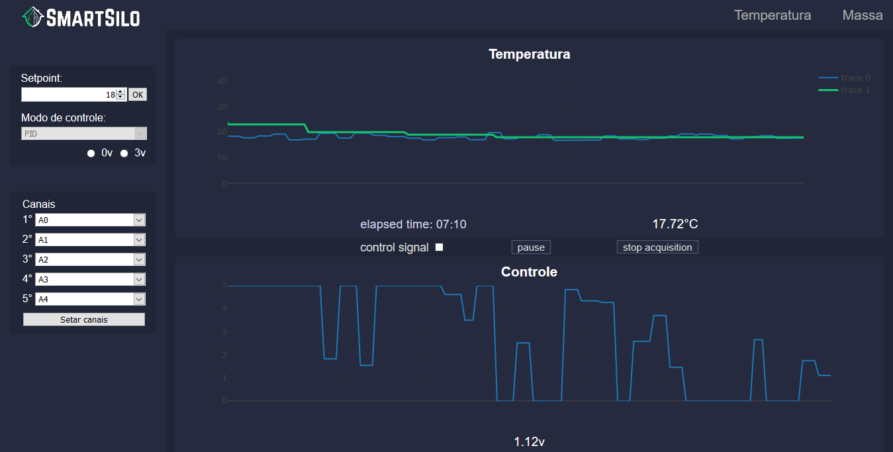

<h1 align="center"> ⚙ SmartSilo 🌱 </h1>

<div align="center">
    
</div>

SmartSilo is a university research project from the Federal University of Rio Grande do Norte. Consists in a a hardware based application for intelligent aeration / drying instrumentation and control in grain storage silos in a IoT context.

Access the project official site: https://smartsilo.netlify.com/

#### This projects uses the following technologies:

JavaScript, HTML, CSS, NodeJS, Johnny-five, Express, Socket.io, PlotlyJS, jQuery, Arduino, Octave.

## Project setup

#### To upload the firmata algorithm to the ESP32 you need to follow this steps below 

## Running the project 

Clone this repository and execute the command 

```
npm install
```

Then finally you can start the server writing 

```
npm start 
```
