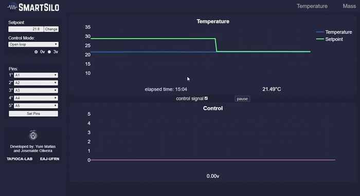
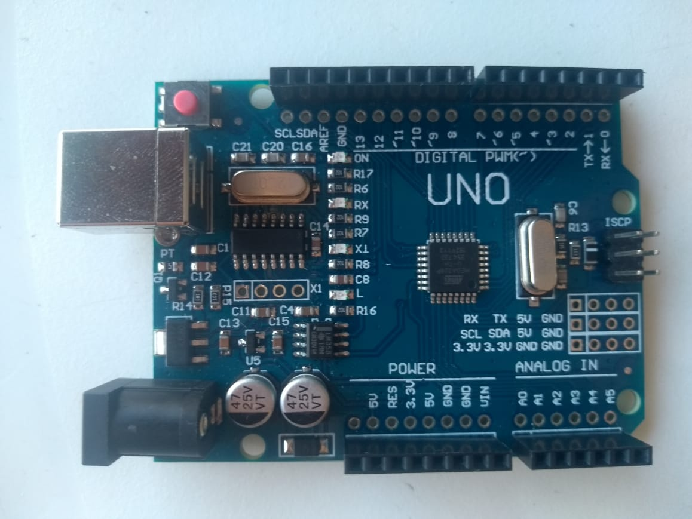
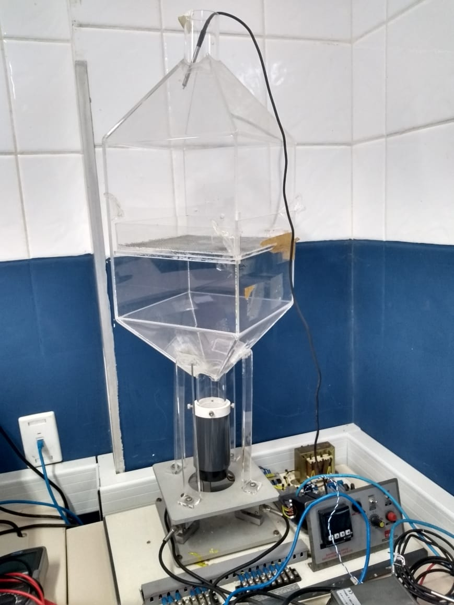
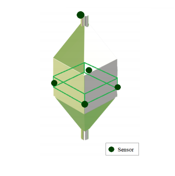
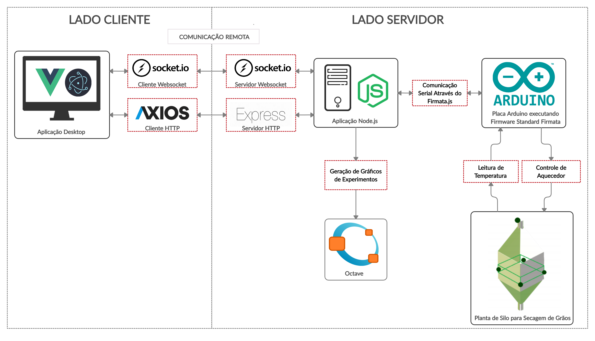

<h1 align="center"> ⚙  SmartSilo  🌱 </h1>

SmartSilo is a research project from
the <a href="http://tapioca.eaj.ufrn.br/?page_id=50&lang=en">TAPIOCA-LAB</a> of <a href="https://ufrn.br/en">Federal University of Rio Grande do Norte</a>   
that consists in a idea of software to remotely monitor and control 
the drying proccess
of grains within storage silos. 

<h2> Justification </h2>

  In view of the low use or absence of technological tools in the country's grain sector and in view of the increase in Brazilian productivity in this field, this project aimed to develop a computer system with instruments and techniques related to automation and embedded systems to give the user the possibility to remotely monitor and control, through an interface with information and graphics, important variables of the grain storage process, such as temperature, mass and humidity inside a storage silo, in order to assist the producer to obtain an optimization on the durability of these products.

<h2> Interface </h2>

  

<h2> Istrumentation </h2>

<table>
  <tr>
    <td>
      <figure>
       
      <figcaption align="center">
          Arduino Uno
      </figcaption>
      </figure>
    </td>
    <td>
      <figure>
       
      <figcaption align="center">
          Grain Storage Didactic Silo
      </figcaption>
      </figure>
    </td>
    <td>
      <figure>
       
      <figcaption align="center">
        Sensors Disposition in the Silo  (image: João Gabriel Quaresma)
      </figcaption>
      </figure>
    </td>
  </tr>
</table>

<h2>Software Tools</h2>

<ul>
  <li>Node.js</li>
  <li>Express</li>
  <li>Vue.js</li>
  <li>Electron</li>
  <li>Socket.io</li>
  <li>Firmata.js</li>
  <li>Node-pid-controller</li>
  <li>Axios</li>
  <li>Plotly.js</li>
  <li>SweetAlerts.js</li>
  <li>Octave-cli</li>
  <li>Arduino board</li>
</ul>

<h2>System Working Diagram</h2>

  

