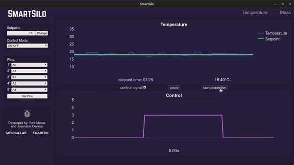
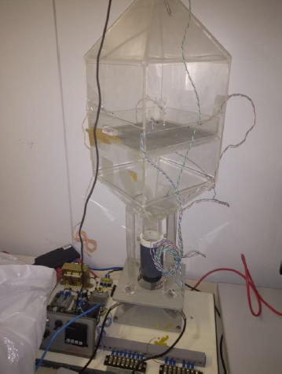

<h1 align="center"> ⚙  SmartSilo  🌱 </h1>

    SmartSilo is a university research project from the Federal University of Rio Grande do Norte. Consists in a a hardware based application for intelligent aeration / drying instrumentation and control in grain storage silos in a IoT context.

<h3>
    Access the <a href="https://smartsilo.netlify.com/">oficial project website</a>
</h3>

<h2 align="center">
    <strong>
        Technologies involved 
    </strong>
</h2>

    <strong>Frontend: </strong>
    VueJS, Vue-Plotly, Vue-Socket.io, Axios.

    <strong>Backend: </strong>
    NodeJS, Johnny-Five , Express, Socket.io, Octave-cli.

    <strong>Hardware: </strong>
    Arduino Board, 5 Thermistors, 3 Load Cells, Didactic Grain Drying Kit  

    
    

